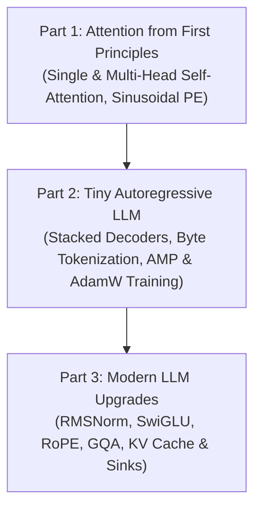

# Advanced LLM Road Map: From First Principles to Modern Architectures

This repository contains a comprehensive developmental roadmap for constructing LLMs, starting from mathematical first principles of self-attention, building up to a functional character/byte-level GPT model, and finally upgrading to modern LLM architectural enhancements (such as LLaMA and Mistral).

---

## Roadmap Overview



---

## Section Details

### 1. Part 1: Basic Attention Model (`1/`)
Contains self-contained implementations of scaled dot-product attention mechanics.
*   **Causal Masking**: Blocks future token visibility during generation via an upper triangular matrix: `torch.triu(..., diagonal=1).bool()`.
*   **Single-Head Attention**: Linear projections to $Q, K, V$ spaces, dot-product calculations, scaling by $1/\sqrt{d_k}$, causal replacement, and value summation.
*   **Multi-Head Attention**: Splits the embedding dimension $d_{\text{model}}$ into $H$ parallel heads of dimension $d_{\text{head}}$, allowing the model to attend to information from different representation subspaces simultaneously.
*   **Positional Encodings**: Details Sinusoidal and Learnable positional embeddings to add sequential coordinates to inputs.

### 2. Part 2: Tiny Autoregressive LLM (`2/`)
Stitches the attention components from Part 1 into a complete Decoder-only GPT model.
*   **Byte-level Tokenizer**: Maps text characters/words directly to raw UTF-8 byte integers (0-255) for a compact vocabulary footprint.
*   **Target-Shift Dataset**: Prepares training buffers where inputs $x$ and targets $y$ are offset by +1 token position for next-token prediction.
*   **AMP Training Loop**: Leverages Automatic Mixed Precision (`autocast`) and `GradScaler` to accelerate training on GPUs while mitigating float16 underflow issues.

### 3. Part 3: Modern Transformer Architecture Upgrades (`3/`)
Upgrades the network layout to mirror SOTA configurations:
*   **RMSNorm**: Replaces standard LayerNorm by normalizing inputs based on root mean square, eliminating the centering step for faster computation.
*   **SwiGLU**: Replaces FeedForward blocks with an activation using gated Swish (SiLU) projections.
*   **RoPE (Rotary Position Embeddings)**: Rotates Query and Key coordinate pairs in 2D vector subspaces to inject relative distance information directly into attention scores.
*   **GQA (Grouped-Query Attention)**: Groups Query heads to share Key/Value heads, reducing memory bandwidth bottlenecking.
*   **KV Cache with Attention Sinks & Sliding Windows**: Caches previous KV values to optimize generation speeds. Integrates a sliding window length $W$ and keeps initial tokens indefinitely to act as high-frequency attention sinks.

---

## Directory Structure

```
.
├── 1/                   # Part 1: Basic Attention Components
│   ├── attn_mask.py
│   ├── single_head.py
│   ├── multi_head.py
│   └── pos_encoding.py
├── 2/                   # Part 2: Tiny LLM Transformer
│   ├── tokenizer.py
│   ├── dataset.py
│   └── model_gpt.py
├── 3/                   # Part 3: Modern LLM enhancements
│   ├── rmsnorm.py
│   ├── swiglu.py
│   ├── rope_custom.py
│   └── attn_modern.py
├── requirements.txt     # Global requirements
└── README.md            # Modern/Road-map README (This file)
```

---

## Reproducibility & Testing

### Installation & Environment Setup
Make sure you activate the virtual environment and install standard requirements:
```bash
source .venv/bin/activate
pip install -r requirements.txt
```

### Run Unit Tests
To run all test suites across all parts in one command:
```bash
PYTHONPATH=1:2:3 .venv/bin/python -m pytest
```

### Run Phase Demonstrations
If you want to run specific component demonstrations:
*   **Part 1 - Attention Visualization Grid**:
    ```bash
    PYTHONPATH=1 .venv/bin/python 1/demo_visualize_multi_head.py
    ```
*   **Part 2 - Tiny GPT Text Sampling**:
    ```bash
    PYTHONPATH=2 .venv/bin/python 2/sample.py --ckpt runs/min-gpt/model_best.pt --prompt "The "
    ```
*   **Part 3 - Modern GPT Text Generation**:
    ```bash
    PYTHONPATH=3 .venv/bin/python 3/demo_generate.py
    ```
